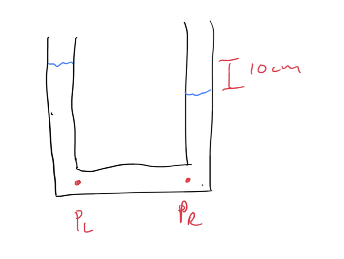

## Reading (Participation only, very short answer)

  - Hydraulic control notes (To be forthcoming)
  - Waves Chapter 7: Read up until (and including) "Group Velocity and Wave
  Dispersion"

### R1: Why do wave crests move forward?

 - sketch the orbitals in a surface wave after Figure 7.6, but include an orbital at the top crest of the wave, and one at the trough.  Do the convergences and divergences make the wave crest move forward?  How do you get waves going in the negative x direction using the same logic?

### R2: Dispersion relation:

Use a graphics package to quickly plot up the dispersion relation (7.40).  Indicate where the deep-water and shallow-water asymptotes are on your plot, and sketch (by hand if you like) the dispersion relations at the asymptotes.

### R3: Energetics of Waves

Why is 7.56 the only term in the energy equation for surface waves?  (see notes
from week 2/3 about energy equations...)

## Assignment

 - Buoyancy and pressure

### A1: Pressure in u-tube (not YouTube) (/5)

Consider a tube bent in the shape of a squared-off "u".  At a given instance of time the water is 10 cm higher in the left side of the tube than the right side of the tube (of course it doesn't stay that way)...

 - What is the pressure difference at the bottom of each pipe?
 - What direction will water flow due to this pressure difference?
 - Does it matter how wide each vertical pipe in the "u" is?  Why or why not?
 - What is the pressure difference is left hand pipe is inclined at a 45 degree
   angle?

### A2: Tilting block (/10)

Consider a block of density $\rho$, with vertical height $L$, and widths in
the other two directions of $d$ floating on top of a fluid of density $\rho_o$.

Demonstrate that the
block is stable to tipping if

$$ \left( \frac{d}{L}\right)^2 > 6 \left(\frac{\rho}{\rho_o}\right)\left(1-\frac{\rho}{\rho_o}\right) $$

Some hints: Consider the torque about the centerline of the block at the water line.  I found this easiest to do by transforming the co-ordinate system so relative to the block so that the block is still vertical, but gravity and the water line are tilted, but either reference frame is fine.  Its best to consider two point sources, one pulling down at the center of mass and one pushing up at the center of buoyancy.  Please no results that depend on engineering formulas (like metacentre), unless you show the derivation of the engineering formula!

