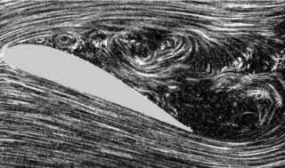

## Physics 426 Fluid Mechanics

Spring 2019

  - Instructor: [Jody Klymak](http://web.uvic.ca/~jklymak)
  - Office: [Bob Wright Centre](http://www.uvic.ca/buildings/sci.html) A313
  - Tel: (250)-472-5969; Email: [jklymak@uvic.ca](mailto:jklymak@uvic.ca)
  - Office Hours: Wed 14:30-15:30 or by appointment
  - Meeting time:  TWF 11:30-12:20
  - Location:  [Ell 161](http://www.uvic.ca/home/about/campus-info/maps/maps/ell.php)

## Course Objectives ##

  - Learn the fundamental properties of fluids.
  - Apply conservation laws to theoretical and practical problems
  - Gain experience with laboratory methods
  - Gain experience in written and spoken presentation

## Schedule

<iframe width="600px" height="400px" src="https://docs.google.com/spreadsheets/d/e/2PACX-1vR7J7yu4NBO7ciH3RHrnsIfVau9djN1nIUci8pRak5ml6ZMXC2G2xf88FroSfNOnAmbVhZsWMhsxm6-/pubhtml?gid=0&amp;single=true&amp;widget=true&amp;headers=false"></iframe>

## [Texts](./Texts/)

Largely *Kundu and Cohen* Latest edition, but also see [Texts](./Texts/).  

## Course grading

5% [Readings](./Readings/)/Class Participation; 30% [Assignments](#Assignments); 35% [Laboratory Project](./LabProject/); 30% Final Exam

Late work penalized as 10% per day, max 5 days.  Academic concessions will be granted
with appropriate documentation as per [UVic's regulations](https://www.uvic.ca/registrar/students/appeals/acad-concession/index.php).

## [Laboratory Project](./LabProject/)


## Assignments

  - [Assignment 1: Due 2 Feb 2018, 11:30 AM](./Assignments/Assignment1.pdf)
  - [Assignment 2: Due 25 Feb, 11:30 AM](./Assignments/Assignment2.pdf)   
  - [Assignment 3: Due 3 Apr, 11:30 AM](./Assignments/Assignment3.pdf)    



[Key](./Assignments/Assignment1Key.pdf)
[Key](./Assignments/Assignment2Key.pdf)
[Key](./Assignments/Assignment3Key.pdf)
[Key](./Assignments/Assignment4Foil.pdf)


## Take Home final:


- [Take Home Final: Due 13 Apr, 23:59](./Assignments/TakeHome2018.pdf)
  - [Key](./Assignments/TakeHome2018.pdf)


## Course Evaluation Survey

These are filled out online at [ces.uvic.ca](http://ces.uvic.ca).  There should be a link to this course on your dashboard.

## Mailing list

Please feel free to contact me through the mailing lists:


[201801-phys426-22462@lists.uvic.ca](mailto:201801-phys426-22462@lists.uvic.ca)


To manage your list, have a look at the appropriate page:


[https://lists.uvic.ca/mailman/listinfo/201801-phys426-22462]( https://lists.uvic.ca/mailman/listinfo/201801-phys426-22462)


Questions that will benefit all your classmates are very welcome on
the list.
