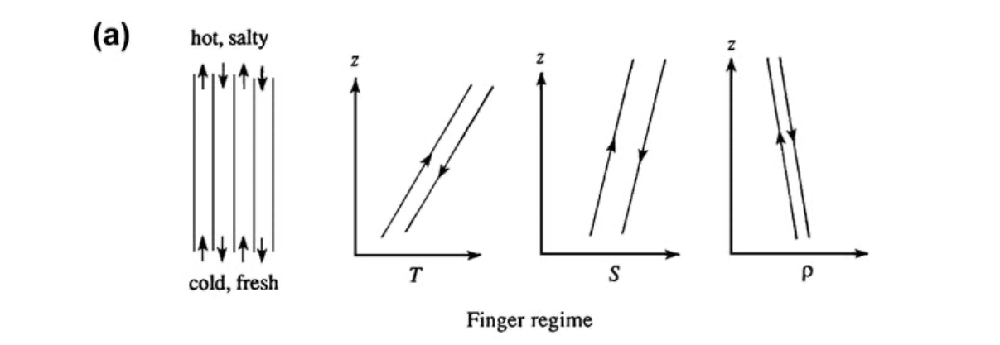
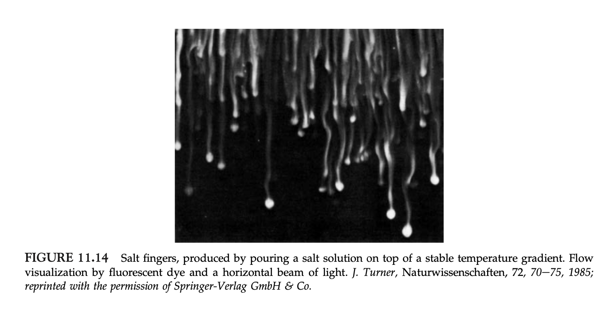
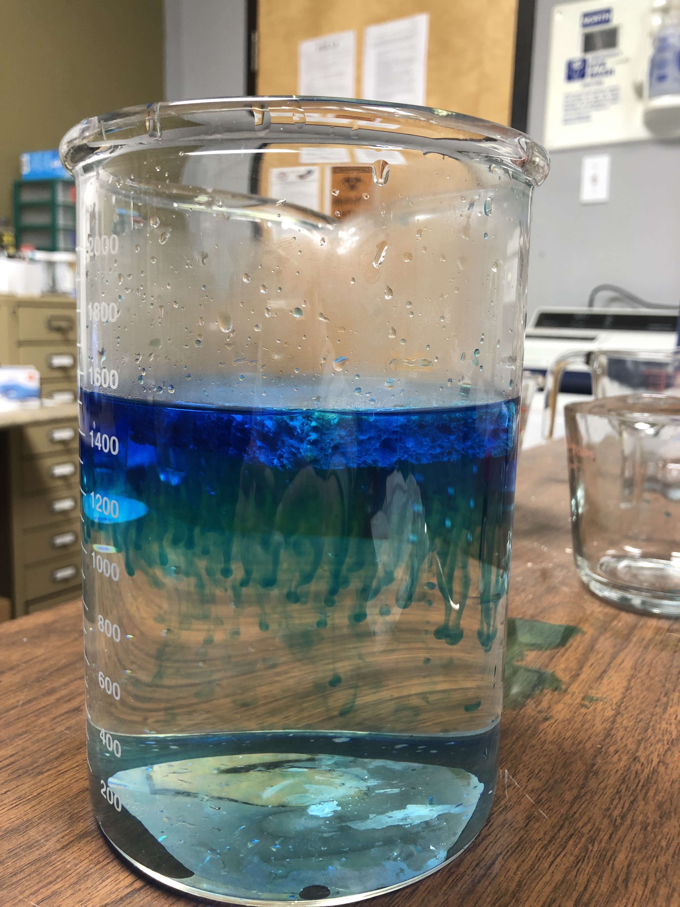
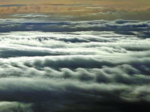
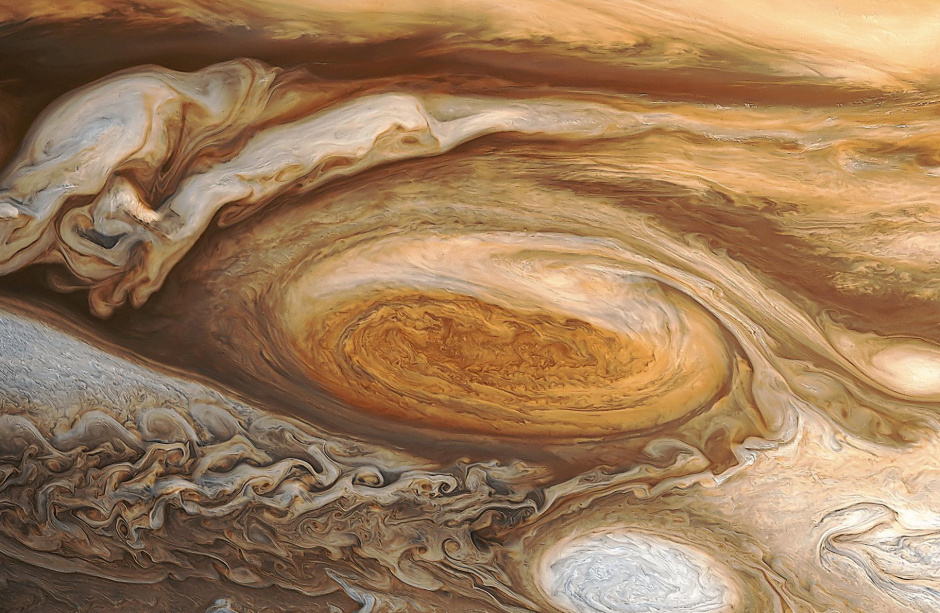
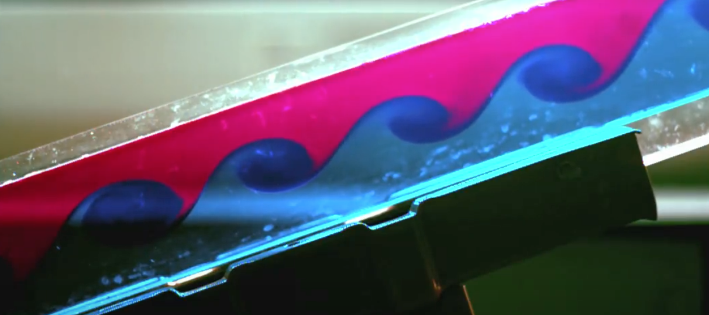

An instability, described in its simplest form, is when a perturbation continuously grows. This demo about instabilities was supposed to be comprised of two different parts: double diffusion, and the Kelvin-Helmoltz instability. Unfortunately due to the Covid-19 pandemic, this demo was performed not in the lab and so due to limited lab resources, only the double diffusion experiment was performed. The Kelvin-Helmholtz instability will also be discussed in this write up, but in lesser detail and without the knowledge of having preformed the experiment first hand.

## Double Diffusion

Helpful youtube links:

https://www.youtube.com/watch?v=bXF0oF0Na6o&fbclid=IwAR0IdZNZEoyb2hXvIxGObAAeE63XrUVRKrFU2L4n7mDhoe3748_gNoX59Ns  
(Double diffusion begins at the 3:30 time mark, my demo is largely based on this video)

https://www.youtube.com/watch?v=cNbMZTCH3S8   
(Double diffusion an alternate way from above, with coffee!)

### Description

Double diffusion is an instability that occurs from the density of fluids depending on two opposing gradients. For the purposes of this experiment, hot, salty water was poured on top of cold, fresh water. Hot water is less than dense than cold water, so the hot water will want to stay on the top and the cold water on the bottom. However, salty water is more dense than fresh water, so the salty water will want to sink to the bottom to be underneath the less dense fresh water. This produces (with a little bit of dye) salt fingers, traveling down bellow the less dense fresh water, where it wants to be. Figure 11.13 (a) from page 554 of the class text book show a graphical representation of this finger instability, and Figure 11.14 also from page 554 of the class text book show an image of what the salt fingers look like in real life. Both pictures have been attached below.

{:width 700}

{:width 700}

### Apparatus

- Large beaker
- Small beaker
- Food colouring dye
- Means to heat water (kettle or hot plate)
- Salt
- Water
- Sponge

### Procedure

Begin by placing a generous amount of cold water into the large beaker. For this, I just simply used the coldest water achievable through tap water. I also placed a few ice cubes in the cold water to keep it as cold as possible while I prepared the rest of my experiment.

I then heated water using a kettle to boiling. Once the water was boiled, I carefully poured some into a small beaker. I then added about one spoonfull of salt into the small beaker and stirred until I was sure all of the salt was dissolved in the water. Next, I added some food colouring dye to the hot water as well.

NOTE - For this experiment to work, it is best for there to be as little turbulence as possible, so be sure to give the cold water ample time to settle down in the big beaker.

Placing the sponge on top of the cold water in the big beaker (and making sure to remove any non-dissolved ice cubes), the hot water was slowly poured onto the sponge in the big beaker. Pouring the hot water very slowly, and on to the sponge, will help to achieve the desired results of this experiment by allowing the hot water to not be dissplaced through turbulence from pouring the water in too quickly.  

### Results

This experiment was run several times trying to find the right balance between water temperatures and salinity in order to create the desired results. The main problem was trying to find the correct amount of salt. At first, too much salt was put into the hot water beaker and so when it was poured into the large cold water beaker, it almost immediately dropped down below the cold water, and did not create the nice salt fingers depicted in the picture above and in the first youtube video link. After several attempts, the right balance was created, and the result was the picture below.



This experiment was noted that it did still proceed quite a bit more quickly than desired, and so it is thought that using water that wasn't quite so hot would aid in being able to produce better results. However, salt fingers were able to be seen and so we concluded the experiment here.

The experiment was also attempted numerous times by using hot, salty water in the large beaker and inserted cold, fresh water at the bottom of the large beaker using a pipette (similar to the coffee youtube video linked above). Unfortunately I was unable to get this version of the experiment to succeed in any way.

## Kelvin-Helmoltz Instability

Helpful youtube links:

https://www.youtube.com/watch?v=qgamfo86FQo  


https://www.youtube.com/watch?v=mf_143gkKSQ  
(A more entailed description of the video above.)

### Description

The Kelvin-Helmholtz instability is an instability resulting from two streams of fluids travelling at two different speeds relative to one another. The simplest way to think about this is well explained at around the 1:30 mark in the second youtube link above. The Kelvin-Helmoltz instability appears in many examples around us such as in clouds (on Earth, as well in other planets such as Jupiter), they also appear from wind blowing over water (which created ripples over water), as well as on the Sun, etc. A few examples of the Kelvin-Helmholtz instability are shown below.





### Appartus

- Long tank
- Means to be able to tilt the tank
- Water
- Salt
- Dye

### Procedure

Following the procedure described in the second youtube link above, the procedure begins by adding fresh water to the long tank that is tilted at about a 45 degree angle until it is approximately half full. Then, salt water is created, and dyed for ease of viewing the instability. The salt water is then very slowly added to the tank from the bottom. Once the tank is completely full, it is sealed shut so as to allow no air bubbles. Then, the tank is very slowly tilted back down from the 45 degree angle, to be aligned horizontally. As this happens, the denser salt water (dyed water) will be underneath the fresh water. Once the layers of the water are settled, the tank is then tipped down (about a 30 degree angle), which causes the two layers of water to move in two different directions. This then produces the Kelvin-Helmoltz instability.

### Results

The results are clearly shown in each of the youtube links above, however here is a still from the second youtube link:




```python

```
