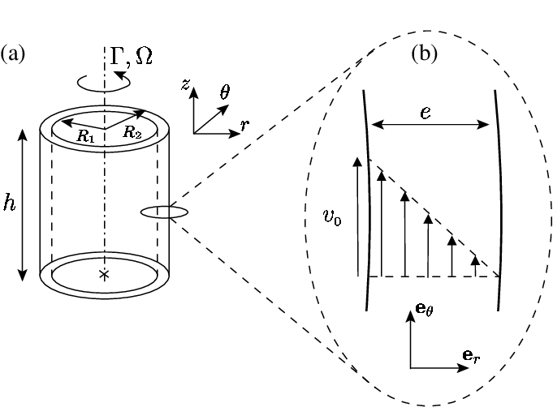

The Laminar Flow demonstration was performed using two seperate systems. The first was a Couette Cell, which utilizes the flow of a viscous fluid between two coaxial cylinders, of which the outer cylinder is stationary and the inner cylinder is rotating. The second demonstration uses an Osborne Reynolds apparatus, which helps visualize the transition between low velocity laminar flow and high velocity turbulent flow through the use of a linear tube containing flowing water and a concentrated streak of dye.

## Couette Cell

#### Description)
A Couette Cell consists of a viscous fluid contained between two cylinders, with the inner cylinder rotating and the outer cylinder reminaing stationary. For steady state flow with low angular velocities, the Reynolds number categorizes the fluid as laminar flow, which means the flow is purely azimuthal in this case. Once the angular frequency is increased beyond a threshold limit, the fluid becomes turbulent and axisymmetric vortices form.

#### Apparatus)
- Couette Cell
- Ink/Dye
- Corn Syrup

#### Procedure)
Begin by pouring the corn syrup in the gap between the two cylinders. In a seperate container, thoroughly mix the ink with a small sample of the remaining corn syrup. Using a pipette, inject the dyed syrup into a concentrated area, careful not to inject air into the mixture.

To show laminar flow, slowly begin rotating the inner cylinder, not allowing the cylinder to wobble or float. Try to keep the rotation speed consistent to avoid introducing turbulence. After sufficiently stirring the dyed syrup into the surrounding syrup, reverse the direction of rotation and resume with the same speed. After reversing the process the dye should return to its original position and orientation if the flow was successfully laminar.

To show turbulent flow, rotate the inner cylinder at a faster speed, or a dramatically changing speed. After reversing the direction, it should be apparent that the dye will not return to its original position due to mixing.

#### Results)
During the set up, we initially used water as the fluid but found that the dyes available would either sink or float as well as diffuse quickly when injected, which didnt leave a good display when reversed. To fix this, we decided to use a more viscous fluid, corn syrup, so we had more time to move through the demonstration before the dye was too diffused to be reversed. Corn syrup also worked well for us due to the fact that higher viscosity inhibits turbulence.

During the demonstration, when we attempted to show laminar flow, it was mostly reversible but there were several sources of error. The apparatus was flawed due to the inner cylinder wobbling back and forth as well as floating when rotated, which mixed the dye instead of stirring it. This could have been remedied by attaching it to the base of the apparatus instead of only at the top, and better fixing the top to the outer cylinder, instead of having it loosely attached. Although there were issues, it was found that the process was mostly reversible.

When we attempted to show turbulent flow, we increased the velocity as well and it was easily shown that the dye mixed and was no longer reversible.

#### Hints)
- Use fluid with higher viscosity than water
- Try to avoid injecting any air with the pipette that would cause the injected fluid to float to the top
- Well mix the dye with the corn syrup for neutral density
- Try and fix the inner cylinder so it doesnt float or wobble

## Osborne Reynolds Apparatus

#### Description)
The second demonstration used an Osborne Reynolds apparatus. This helps visualize the transition between low velocity laminar flow and high velocity turbulent flow by using a concentrated streak of dye through a test tube with a known outflow velocity, allowing the Reynolds number to be calculated. When the flow had sufficiently low velocity, and therefore low Reynolds number, a single flow streamline was observable through the dye, which would mix and split apart when the velocity climbed above a threshold limit.

#### Apparatus)
- Hydraulics Bench
- Osborne Reynolds Apparatus
- Ink/Dye
- Known volume container
- Stopwatch

#### Procedure)
To begin, the Osborne Reyonolds apparatus was placed on a solid, vibration-free table. The inflow control valve was opened and the tank was allowed to fill such that the flow through the overflow pipe was minimal. The system was then run for five minutes to allow the air in the tubes to release.

To visualize laminar flow, the inflow was stopped, as we found it helped stabilize the water for such slow speeds. The outflow pipe was then opened and the dye control valve was opened, allowing the dye stream to enter the test section. The outflow valve was adjusted until a single, straight streamline was observed. The outflow was then collected into a 1L container, and the time it took to fill was recorded. The collected water was then removed and the hydraulics bench was refilled with clean water.

For turbulent flow, the procedure was repeated, with the inflow allowed to continue to run, as we found the tank emptied too quickly to take accurate measurements without it. When the dye valve was opened, the flow pattern was seen to be chaotic in the test section.

After the tests for laminar and turbulent flow were ran, the Reynolds number was calculated for both and confirmed to be within the correct range for each test.

#### Results)

Using the sample calculation below:

The values used in the calculations were the following: \
For turbulent flow, average time = 9.32 s, Re = 8680 \
For laminarflow, average time = 51.52 s, Re = 1570

For our particular set up, the threshold flow speeds were found to be: \
Laminar: U < 0.098 m/s \
Turbulent: U > 0.197 m/s

It was also confirmed that: \
Laminar Flow: Re<2000 \
Turbulent Flow: Re>4000 \
Transitional Flow: 2000<Re<4000

Laminar Flow:

Turbulent Flow:

#### Hints)
- Use heavy, dark dye
- Turn the inflow pump off for laminar flow
- Always replace the water in the hydraulics bench with clean water instead of the used, dyed water
- Let it run for 5 minutes before beginning to take data
- Take the temperature to use the temperature dependant viscosity for water for the calculation of the Reynolds number
