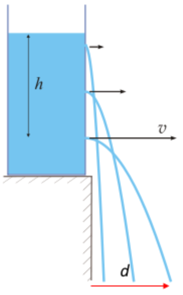

## Pressure - Torricelli's Law

The speed of flow $v$ through a hole at the bottom of a tank filled to a height $h$ is the same as the speed that a body would acquire in falling freely from $h$.

$$ v = \sqrt{2gh} $$

This expression comes from equating the kinetic energy gained with the potential energy lost. Since $h$ is proportional to pressure $P$, and $v$ is proportional to horizontal distance $d$, find that:

$$ d \propto P^{1/2} $$   

To demonstrate, fill a tank with water to a height $h$. Release the water from an opening near the bottom of the tank (a bucket with a valve works well), and notice that both the range $d$ and velocity $v$ of the released jet decrease as $h$ decreases. To explore the parameters of the experiment, try different sized tanks and release holes; do these changes affect $v$ as the water leaves the hole?

Figure 1. A simple pressure experiment, demonstrating Torricelli's Law.

By taking measurements of these changing values, a *simple* plot of the square root power law governing the equation can be obtained (Figure 2).

Figure 2. Distance and velocity versus height. Both the observations (above) and theory (below) appear to follow a square root power law.

## Pressure - Siphon

The speed $v$ of water leaving the opening of a siphon is dictated by the vertical height $h$ from the surface of water in the tank to the opening of the hose, once again by:

$$ v = \sqrt{2gh} $$

A siphon can be demonstrated by running a hose from the bottom of tank, up and over the side (well above $h$), and then down to empty below $h$. You may need to get it started by raising or lowering the outside of the hose to adjust for pressure differences that exist within; or, be sure to clean the hose if you're going to get it going the "old fashioned" way.

By adjusting the vertical height of the opening of the hose as compared to $h$, the flow rate of the water leaving the hose will change, with $v = 0$ $[m/s]$ at the level of the surface. If possible, hold the hose above $h$ and check the water level inside; how does it compare with $h$?. The pressure of water above the hose opening *inside* the tank can only force water out the other end up to the surface height. If this is true, how does water make it through the section of hose that is above $h$ (B in Figure 3), where it passes over the wall of the tank?

Figure 3. A simple siphon experiment, showing points and parameters of interest.

The physics of siphons is somewhat of a mystery, with two theories to consider:

* A point of *lower than atmospheric* pressure is created at the apex of the hose (above $h$), allowing atmospheric pressure at the tank’s surface to push water up the hose and through this section. However, it has been shown that a siphon can work in a vacuum.
* As gravity pulls the fluid down and out of the hose, outside of the tank, more is pulled along due to liquid cohesion (strong cohesive bonds in the fluid), like a chain. However, siphons have been achieved with weakly bonded gases.

To further explore the parameters of this experiment, try varying the height of the hose opening that is *inside* the tank, or using hoses of various widths and lengths. How do these changes affect the velocity of the water as it exits the hose, as compared to the original setup?

## Bernoulli Apparatus

The Bernoulli aparratus is used to demonstrate how a pressure gradient can accelerate a fluid. The apparatus (Figure 1) consists of a pipe which starts with a cross sectional area $A_0$ that then tapers inward to an area $A_1$. The pipe is connected to a pump which forces water through the pipe. Along the pipe there are a number of outflows to vertical tubes where the water level indicates the pressure at that location along the pipe.

Turn on the pump and open the valve to allow outflow. Let it run until all the air bubbles have been removed. Close the valve so there is no longer any flow. Without flow the pressure becomes the same along the pipe. This is indicated by the equivalent height of water in the vertical tubes.

Open the valve so that there is once again flow through the pipe. In a steady flow the inflow = outflow, so that:

$$ \rho v_0 A_0 = \rho v_1 A_1 $$
Therefore:

$$v_1 = \frac{v_0 A_0}{A_1}$$

If $A_0 > A_1$ then $v_0 < v_1$. The flow is accelerated from $v_0$ to $v_1$ along the pipe by a pressure gradient force visible in the vertical tubes, as there is high pressure at the wide end and low pressure at the narrow end. The pressure gradient manifests when the water starts to flow from rest and then 'runs into' the tapered pipe, which causes a compression wave that acts to builds up a sufficient amount of pressure to force the flow through the narrowing pipe. Although we often consider water to be incompressible, it is actually slightly compressible, else the compresion wave, which is a sound wave, would not propagate.

Figure 4. Bernoulli apparatus. For steady flow, a pressure gradient must exist to force water through the narrow section of pipe.

## Buoyancy

Buoyancy is a force exerted by a fluid that opposes the weight of an immersed object. Archimedes' principle states that the buoyancy force that is exerted on an immersed body is equal to the weight of the fluid that the body displaces.

To demonstrate the stable and unstable equilibriums between the force of gravity and the buoyancy force, a buoyant float can be used, where the position of the centre of mass is adjustable. If the sum of the moments due to gravity and buoyancy result in a restoring moment the object is stable; otherwise, it is unstable with an overturning moment (Figure 2). This effect is important to consider in designing boats and buoys.

Figure 2. Stable and unstable equilibrium. An object with a restoring moment will naturally right itself, and vice versa.

Another exercise to demonstrate the application of the buoyancy force is to examine the buoyancy frequency of an object displaced in a fluid. This can be done by placing a styrofoam cup in a basin of water and adding different amounts of weight to the cup. If you impart a downward force to the cup it will oscillate. This motion may be hard to capture visually, as the system is heavily damped by friction, but is given by $ 𝑧(𝑡)=𝑧_0+𝐴_0 cos⁡(𝑁𝑡)$. The oscillation frequency ($N$) is given by:   

$$ N = \sqrt{- \frac{g}{\rho_0} \frac{\partial \rho (z)}{\partial z}}$$    

and is called the Brunt–Väisälä frequency, where $\rho_0$ is the density of the displaced parcel (in this case the cup + weights) and $\frac{\partial \rho (z)}{\partial z}$ is the verticle density gradient of the fluid. For $\frac{\partial \rho (z)}{\partial z} <0$, as in most water, $z(t)$ has oscillating solutions with frequency $N$. This frequency only depends on the density of the displaced parcel and the density gradient of the surrounding fluid, and not on the magnitude of the initial displacement.

Figure 5. Buoyancy frequency. A buoyant object that is forced downward into a fluid, beyond equilibrium, will experience a damped oscillation.
