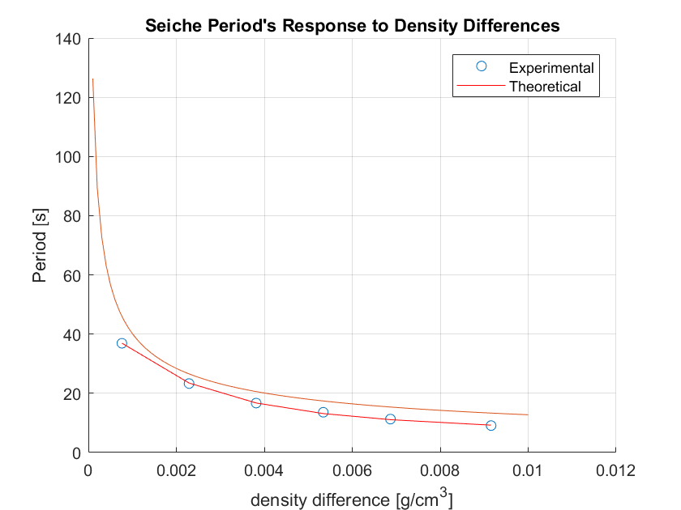

## I. Abstract
Two demos were tryed to be replicated in the lab, to better understand stratified flow. Firstly, a tank with a dividing barrier was used to demonstrate internal wave period's response to density differences.The lock exchange was used to sucessfully reproduce the seiche period in a lake within the limitations of a labratory experiment. Secondly an inverted sill (or boat) was towed in a long tank to reproduce the 'dead water' effect. The effect theorizes that a boat moving in stratified
environment experiences a powerful drag due to the internal waves. The drag force becomes larger when the boat speed reachs the propogation speed of the internal waves. This is caused by the drag on the ship, which is induced by internal waves. Due to the sensitive nature of the labratories system, it was difficult to observe that the maximum drag was obtained when the boat speed matched the internal wave speed. Overall the demo was sucessful in displaying internal waves in a stratified fluid.

## II. Procedure
### Seiche Period
Firstly, a line on the tank was drawn to streamline multiple trials to compare multiple varying salinity differences between the two sides of the lock. The length, height, and width of the tank were recorded.Water was then added to the drawn line, and the lock put in place. Salt was then measured using a scale, and then stirred into the one side of the lock. Food colouring was added to depict the different density layers. The lock was then released and the seiche period of the tank was timed. This was repeated for different salinity differences, then compared with a theoretical curve for density differences compared with seiche period of the rectangular tank. Where the period T, is given as:
                                                    $$T = (2L)/c$$
This is the Merian Formula, where L is the length of the tank and c is for an internal wave is:
                                    $$c = \sqrt((g.*((\rho2-\rho1)/\rho2).*(h1.*h2/(h1+h2)))) = \sqrt(g'*(h^2/2h))$$
Thus, the seiche period becomes:
                                    $$T = 2L/\sqrt(g'*(h^2/2h))\label{eq3}$$

### 'Dead Water' Effect
A two layer stratification was setup in a long tank. It is to note that it was done by dumping dyed freshwater on top of dense water. A inverted sill was then towed by hand at varying speeds to observe the drag differences and the induced internal waves at the stratified interface. The tow speeds were varied to try to see its response to drag.

<video src="http://ocean-physics.seos.uvic.ca/~jklymak/Movies/PoitrasStratified20.mov" controls>
      Your browser does not support the <code>video</code> element.
</video>

## III. Results
### Seiche Period
One Run of the demo is depicted above.
It clearly depicts internal waves that react strongly to the density differences.
When the experimental results were compared with the theroretical curve, the curve was exponential as expected. Larger density differnces experiences the shortest periods, as depicted bellow:

### 'Dead Water' Effect
The 'Dead Water' effect was observed in the demo though wasn't able to be captured in high enough resolution due to a few flaws with the setup of the demo, specifically turbulence. A good youtube link is provided bellow to try to depict what was being reproduced in the demo:

<https://www.youtube.com/watch?v=PCOL8kUtufg>

## IV. Discussion
### Seiche Period
The Seiche period in the above figure clearly depicts a exponential growth as expected, though it's period is consistently lower then the theoretical curve. This is most likely due to the absence of the viscous forces in the theoretical derivation. This is likely important in the tank that was used, though in a large body of water such as a lake, viscous forces would likely be negligible. Future demos could potentially use larger tanks to minimize viscous forces. The video showed that the surface interface propagated minimally comparitively to the internal wave interfaces, as theorized in our notes. It also showed that once mixed the bottom wave propagated slower then the top wave, due the smaller density difference. Overall the seiche period was sucessfully demonstrated at different density levels.

### 'Dead Water' Effect

The 'Dead Water' effect was observed in the lab, though the system wasn't sensitive enough to observe varying levels of drag. A few improvements to the system would likely improve future demos in recreating the effect. First, the stratified layers could be improved by siphoning dense water underneath freshwater, to avoid creating turbulence/mixing. Secondly, the "inverted sill" could have been towed from a line rather then by hand to avoid downward diffusion of momentum. Ultimately the generation of internal waves were observed, though were influenced by the turbulence of the system.

## Hint/suggestions:  
Future demos could look into varying the densimetric Froude number for subcritical and supercritical speeds given by:
$$ Fr = U/\sqrt{g'h}$$
Where u is the flow velocity, g' the magnitude of the reduced mass, and h the depth.
