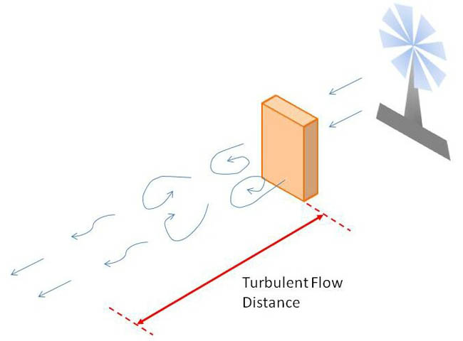
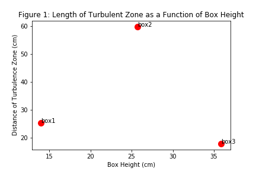
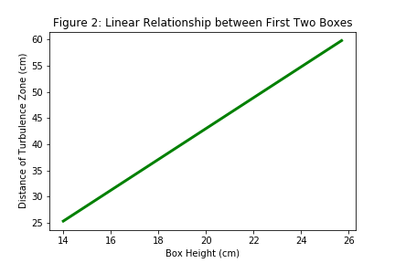
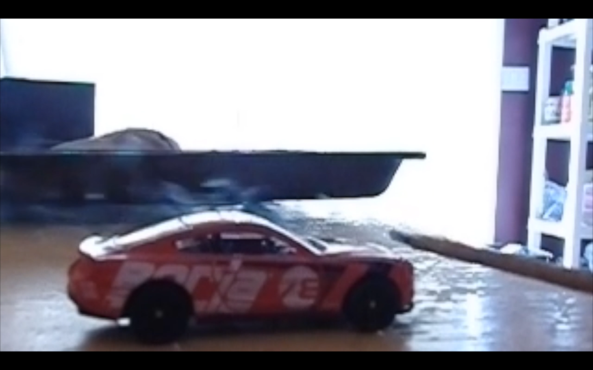
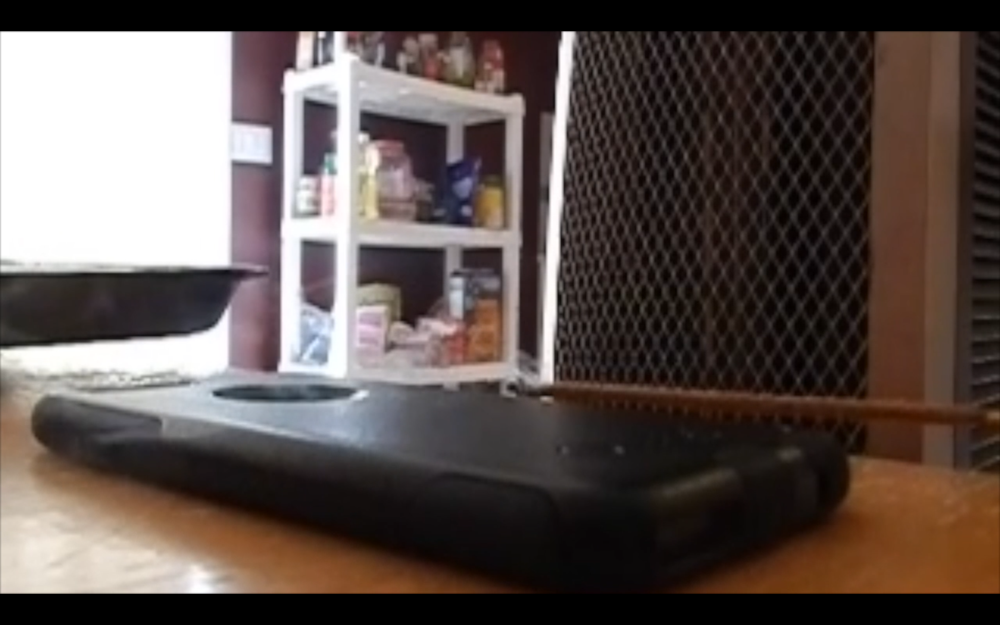

## (Using Household Objects)

- By: Mathew Ens and Dezy Manuel

## Introduction/Theory

#### What is turbulence?

* Turbulence is fluid motion in which there are chaotic changes in flow velocity and pressure
* turbulence is strongly non-linear (making it hard to calculate)
* Turbulent flow is characterized by high reynolds numbers
* Examples of turbulence are:
    - surfing
    - fast flowing rivers
    - weather and storm clouds
    - smoke from a cigarette
    - the flow over vehicles such as cars, airplanes, and submarines

#### The Reynolds number:

The Reynolds number is given by the following equation:

$Re = \frac{\rho VD}{\mu} = \frac{UD}{\nu}$

where $\rho$ = density of the fluid, V = U = velocity of the fluid, $\mu$ = dynamic viscocity, $\nu$ = kinematic viscocity = $\frac{\mu}{\rho}$, and D = diameter

* It is easier to produce turbulence in fluids that have low viscosity. I.e.) If you disturb Water and Corn Syrup in the same way, the water will have more turbulence
* We will be producing turbulence in air and in water in the demos
* The kinematic and dynamic viscocity for air and water are:

Table 1: Dynamic and Kinematic Viscocities of Air and Water

| Fluid Type | Dynamic Viscocity ($\mu \mathrm{Pa\cdot s}$) @$27^{\circ}$ C  | Kinematic Viscocity ($\frac{m^2}{s}$)|  
|---|---|---|
| Water  | 900   | $1.0x10^{-6}$  |
| Air  |  18  | $1.5x10^{-5}$  |

#### Turbulence vs. Laminar Flow:

Depending on the properties of a flow, it can be charactergorized as Laminar or Turbulent flow:

* Turbulent flow has the following properties:
    - Has chaotic fluid flow with flow instabilities
    - Inertial forces dominate
    - Have high reynolds Numbers (Re>4000)

* Laminar flow has the following properties:

    - Has smooth, constant fluid motion
    - Viscous forces dominant
    - Have low reynolds numbers (Re<2100)

## Demo 1: Measuring Turbulent Airflow around a Box

{:width="700px"}
Figure 1: Measuring turbulent streamlines for the first box

#### Description:

In this demo, turbulent airflow is measured around a box. Since vortices occur on the downwind size of a building or obstacle, we can measure the distance where turbulent flow takes place on the downwind side of the box as a function of box height. This is done by measuring the streamlines of airflow from a fan using a “streamer”. The distance from the downwind side to where the turbulence dies off can be measured for different heights using three boxes.

#### Apparatus:

{:width="700px"}

Figure 2: Diagram of Apparatus

#### Materials:

* three boxes of equal size
* Measuring Tape
* Fan
* Long Pole
* Streamer

#### Procedure:

First we tied streamer to the end of pole, and placed a box $42.5\pm 0.1 \mathrm{cm}$ in front of the fan with the fan on the highest setting. Standing off to the side of the fan, the streamer was held just below the top of the box on the downwind side and the streamer was slowly moved away from the box. Chaotic motion in the streamer characterized by turbulent flow was observed until the streamer direction began to flow only away from the fan, at which piont the pole was lowered to the ground, and the distance of the turbulent zone was measured from the box to the box using a measuring tape. This process was repeated three times for accuracy and then a new box was added on top and was repeated for a total of three boxes.

#### Data/Results:

- Distance from box to fan: d = (42.5 ± 0.1)cm
- Width of fan: w_fan = (34 ± 0.1)cm
- Thickness of box = (4.5 ± 0.1)cm
- Width of box = (19 ± 0.1)cm

Table 2: Box Heights for Box1, Box2, and Box3

| Box # | Height (cm) |
|---|---|
| 1  | 900   | $14.0 \pm 0.1$  |
| 2 |  18  | $25.7 \pm 0.1$  |
| 3  |  18  | $35.9 \pm 0.1$  |

Table 3: Turbulent Distance Data

| Box Type | 1 Box (cm)  | 2 Box (cm) | 3 Box (cm) |   
|---|---|---|---|
| Trial 1  | $24.5 \pm 1.0$ | $64.0 \pm 1.0$ | $21.0 \pm 1.0$ |
| Trial 2  | $27.5 \pm 1.0$ | $52.5 \pm 1.0$ | $16.5 \pm 1.0$ |
| Trial 3  | $24.0 \pm 1.0$ | $63.0 \pm 1.0$ | $16.0 \pm 1.0$ |
| Avg: | $25.3 \pm 1.7$ | $59.8 \pm 1.8$ | $17.8 \pm 1.8$ |

The following graphs are produced for the turbulent distance as a function of height for the boxes:

{:width="700px"}

{:width="700px"}

The following data was obtained from the linear graph of the first two boxes:

Slope: 2.949±1.8, Intercept: -15.95 cm, r-value: 1.0 (obvious since only two points were considered

#### Summary/Conclusion:

We were expecting a linear relationship between the turbulent distance and the height of the boxes. However, there was a linear relationship only between the first two boxes (although there will always be a line between two points). Possible errors in the experiment causing the third box to not obey this linear relationship include the fact that the initial assumption was that the boxes were suppose to be at the same height, but they instead had different heights. Additionally, the height of the third box exceeded the height of the fan, thus the flow was not straight as compared to with the other boxes.

## Demo 2: Turbulent Streamlines around Household Objects

{:width="700px"}
Figure 3: Flow around a toy car

{:width="700px"}
Figure 4: Flow around a cell phone

#### Description:

In this demo, the flow around a toy car and a cell phone are shown using smoke from incense. When fluid flows around a blunt object (like a car), regions of turbulence form. Since the fluid velocity is slow, we can observe some smooth streamlines in addition to eddies and turbulence. If the fluid flow was faster, more eddies would form which would make the fluid flow more turbulent and hard to predict.

#### Apparatus:

As seen in above images. A fan on a low setting blew smoke from incense over two household objects: a toy car and a cell phone.

Materials:

* Toy Car
* Cell Phone
* Incense (To visualize streamlines)
* Fan at the lowest setting

#### Procedure:

A Fan on the lowest setting (so the smoke would not disspiate) was placed on a table infront of a toy car and a cell phone. Incense was used to show the turbulent streamlines over both objects.

#### Results/Summary:

The fluid velocity was slow in order to visualize the flow, thus some smooth streamlines as well as turbulent streamlines were shown.

#### Applications:

Engineers and scientists use CFD Analysis (Computational fluid Dynamics) to show velocities, pressure, gradients, and flow around objects. This is expecially useful to an engineer designing different kinds of objects, like buildings or cars to see how different fluids like air or water are going to interact with them. They might be interested in detecting turbulent flow around a car for example.

## Demo 3: Turbulent vs. Laminar Flow in a Bottle

{:width="700px"}
Figure 5: Turbulent flow through a rough hole in the bottle

{:width="700px"}
Figure 6: Laminar flow through smooth hole of bottle

#### Description:

In this demo, the flow from two holes in a bottle is observed. We expect some eddies and turbulence from the rough, serrated hole, and we expected laminar flow for the smooth gradual hole.

#### Apparatus:

The apparatus is as shown in the above two pictures for this demo. A bottle with a smooth hole (the normal opening of a 2L pop bottle), and a serrated, rugged hole of approximately equal size on the bottom of the bottle.

Materials:

* Bottle with two holes:
* One hole is rough and at the bottom of the bottle, and one hole is smooth and has a gradual transition.
* Food colouring: red for laminar flow, blue for turbulent
* Water

#### Procedure:

A serrated, jagged hole was cut on the bottom of a 2L bottle. Water with blue dye was put in the bottle using a hose, and the water was allowed to flow through that hole, creating turbulent flow. Then, water was filled again into the bottle and red dye was put inside. The bottle was flipped upside down and water was allowed to flow through the smooth hole, creating laminar flow.

#### Results/Summary:

Turbulent flow was observed through a roughly cut hole in the bottle, in which the friction on the water due to the ragged plastic of the bottle created small edies and vortices. Laminar flow was observed from a smooth hole of approximately the same size. The laminar flow occured quicker than the turbulent flow, due to the way the bottle is shaped with a gradual transition in volume to the smooth hole, and due the friction of the jagged hole with the water slowing it down.

# Link to Turbulence Demo Video:

## Our Demo was made as a video. Click **[here](http://ocean-physics.seos.uvic.ca/~jklymak/Movies/EnsManuelTurbulence20.mov)** to view the turbulence demo through google drive.
