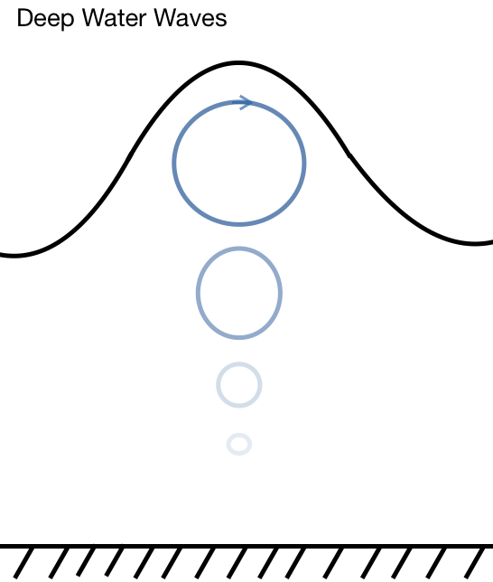

## Relating speed to wavelength 

This demonstration explores the characteristics of waves in a tank. The first goal was to estimate phase speed and relate it to the water depth. The wave maker was set to a constant setting and then a camera recorded an approximately one meter section of the tank roughly halfway down the length of the tank. Viewing the tank too close to the wavemaker doesn't allow enough time for smooth waves to be evident, whereas waves towards the end of the tank are interacting with the wall and the smooth wave pattern is obscured by interference from reflected waves. This is why a midpoint was chosen for viewing and recording. Two metersticks were taped to the tank perpendicular to one another within the field of view of the camera. To calculate the speed, a point on the tank was chosen and lined up with the crest of a wave. I then clicked through the frames until the next crest passed the point and a value of time was obtained. The wavelength was estimated by looking at a single frame and using the ruler along the bottom of the tank to gauge the distance. This gave me phase (crest) speed of c according to the equation below:

$$ c_{crest} = \frac{\lambda}{T} = \lambda f  $$

The camera shot at 30 frames per second, which gives a fairly high level of accuracy for this application. In measuring the wavelength there was a higher margin of error as the ruler is on the bottom of the tank, which is up to 30cm below the point being measured. Measuring the distance became even more difficult when I tried to generate waves with an long wavelength, as the total wavelength became longer than the field of view of the camera. I attempted to measure the distance of one crest and one trough and then double it, but these features were hard to pinpoint without the full wave in view. I also found that longer wavelengths became more susceptable to interference from reflected waves off the end of the tank and so these tests had lower agreement between measurements.

These values should theoretically coincide with the dispersion relation:

$$ c_{p}=\frac{\omega}{k}=\sqrt{\frac{g}{k}tanh(kH)} $$

where,

$  k = \frac{2\pi}{\lambda}  $

Now consider a shallow water environment where wavelength is long compared to the depth:

According to the dispersion relation, as $kH\rightarrow 0$

the term $ tanh(kH)\rightarrow kH $

or $tanh(kH)\simeq kH$

The result is the shallow water approximation for phase speed:

$$ c_{p}=\sqrt{gH} $$

If we consider a deep water environment where wavelength is short relative to the depth:

the term $ tanh(kH) >> kH $

and $tanh(kH)\simeq 1$

Which gives us the deep water approximation for phase speed:

$$ c_{p}=\sqrt{\frac{g}{k}} $$

For a wave to be considered a true shallow water wave $ kH < 0.3 $, so considering that the depth of the water in the tank was approximately 0.215 meters, this would have required that $k \simeq 1.4$ or that $ \lambda \simeq 4.5$ meters. So based on this I was unable to generate true shallow water waves.

To generate true deep water waves the wavelength should be shorter than one tenth the water depth, in this case less than 0.0215 meters, or that k is greater than 292. I wasn't able to generate waves that truly satisfy this approximation either, so calculating the speed would require the full dispersion relation and my values should fall on the line between the shallow and deep water approximations.

In the figure below I have plotted my experimental values, as well as the dispersion relation to compare my results to theoretical curve.


Figure 1. The dispersion relation (blue) as well as the approximations at either end for shallow and deep water wave behaviour.

## Studying particle motion using dye

This portion of the demonstration would be best with true deep and shallow water waves, but I was able to observe the expected effects in my demonstration. To demonstrate the behaviour of particles in waves I added dye throughout the length of the water column and then observed how the dye moved as waves passed through it.

<table><tr>
<td>  </td>
<td>  </td>
</tr></table>
Figure 2. Particle motion in deep versus shallow water waves.

Figure 2. Shows how the orbitals in deep water waves dissipate with depth and so there will be no motion at the bottom of the water column. Shallow water waves will show particles moving in flattened ellipses and will not have dissipated before reaching the bottom, so interactions with the lower surface will be evident. These effects were observed in the demonstration, although not as clearly as if they had been purely deep or purely shallow water waves.


## Making a group of waves

In this part of the demonstration the wavemaker was turned on and off again to create a wave packet. We found that producing five waves consecutively to be the best for demonstrating group speed versus phase speed. What we saw was that wave crests appeared to move through the packet at a higher rate than the packet as a whole moved. These faster moving crests emerged at the back of the packet and then raced to the front before dying. Although prior to this we focussed on the phase speed, the speed of the envelope or the "group speed" is actually more important. This is because the group speed is the speed at which energy is being transferred,  which makes it a more useful value to quantify for most applications.


## Breaking waves on a beach

In the final part of my demonstration I put in a ramp at the end of the tank to represent waves breaking on a beach. I had to play around with the placement of the ramp as well as the wavelengths but the physical mechanisms of breaking waves could be observed in the wave tank. As waves came in the would steepen as the bottom orbitals encountered the friction of the surface. The particles at the top of the wave were less effected by this stress and continued to move at their respective phase speed. Eventually this differential stress would cause the wave to tilt to the point of breaking, similar to how you might observe waves on a shallow sloping beach.


```python

```
