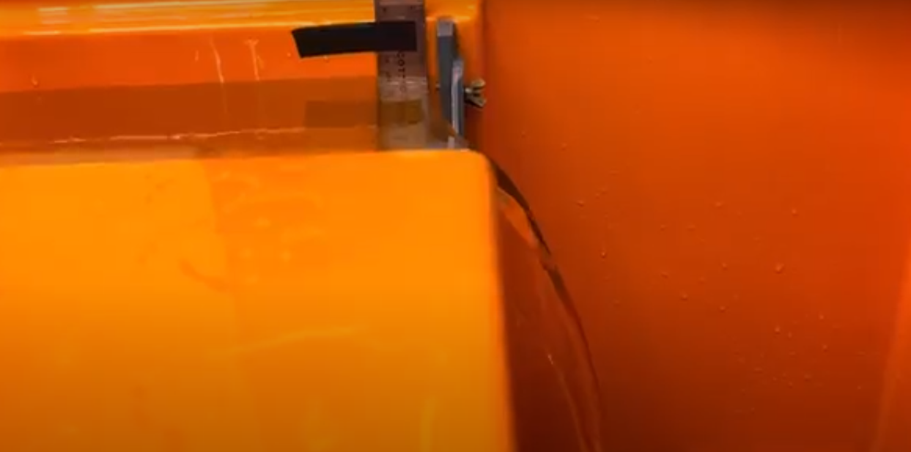
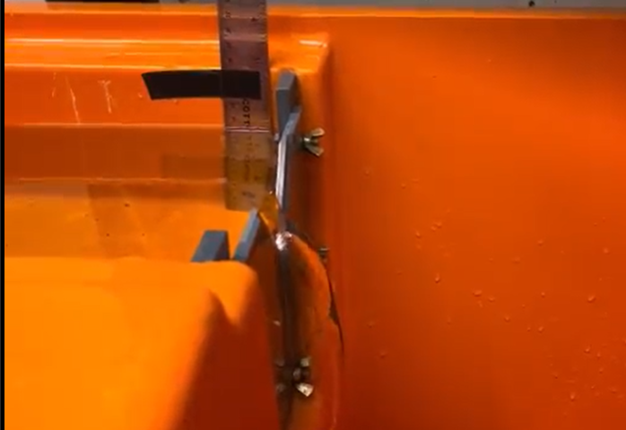
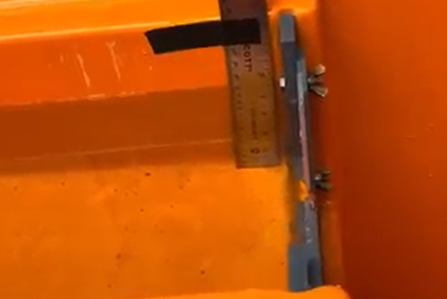

## Theory

In this experiment, we explore the dynamics of channel flow featuring an obstacle positioned midway along the channel. The experimental setup involves maintaining a constant inflow rate, represented by $ q $, throughout the channel. Upon reaching equilibrium, it is observed that the water level at the obstacle is $ d $ above the height of the obstacle.

When the inflow rate is altered, conservation laws dictate that $ d $ will also change. However, the system requires a certain duration to adjust $ d $ and achieve a new equilibrium configuration. This phenomenon of time delay in adjusting $ d $ is termed hydraulic hysteresis.

## Methods

1. **Experimental Setup:**
   - A channel flow apparatus was assembled with an obstacle positioned halfway down the channel.
   - The downstream reservoir was intentionally kept at a low level to ensure the channel started dry.

2. **Flow Speed Setting:**
   - A moderately slow flow speed was set to initiate the experiment.
   - The evolution of the flow was observed and recorded.

3. **Observations Recorded:**
   - The following data points were noted:
     - The time taken for water to start spilling over the obstacle.
     - The time taken to reach steady state flow conditions.

4. **Inflow Rate Variation:**
   - The inflow rate was systematically varied.
   - Changes in the flow behavior were observed and recorded.

## Observations 
1. - Water level when water just starts to spill = 11.8 cm
   - First inflow rate = 1000 mL/(1:36 - 1:30) = 1L/6 sec = 166.67 $cm^3 \, s^{-1}$
   - Maximum inflow rate
   - Water height = 13.7 cm
   - d = 13.7 cm - 11.8 cm = 1.9 cm
   - Time it takes to attain equilibrium = (0:45 - 0:15) = 30 sec

2. - Medium Inflow rate: Decreased the inflow rate
   - Second inflow rate = 1L/(2:45 - 2:31) = 1L/14 sec = 71.43 $cm^3 \, s^{-1}$
   - Max height = 13.2 cm
   - d = 13.2 cm - 11.8 cm = 1.4 cm
   - Time it takes to attain equilibrium = (2:11 - 1:52) = 19 sec

3. - Lowest inflow rate: Started from zero flow
   - Third inflow rate = 1L / (6:29 - 5:56) = 1L/33 sec = 30.3 $cm^3 \, s^{-1}$
   - Water height = 12.1 cm
   - d = 12.1 cm - 11.8 cm = 0.3 cm
   - Time it takes to attain equilibrium = (5:43 - 5:08) = 35 sec

   
 
 

4.  - Measuring total time : Started from zero flow and new inflow rate
    - First video
    - Inflow rate = 1L / (0:38 - 0:21) = 1L/17 sec = 58.82 $cm^3\, s^{-1}$
    - Total time to fill the reservoir = (4:54 - 0:21) = 1L/473 sec
     
 ## Discussion
   - Here is the graph of d vs q:
   
   
   - Our data points are almost in a good agreement with the theoretical prediction of $d \propto q^{2/3}$. Discrepancies in the plot are due to error in our measurements. 
   - It takes 473 sec for the water to start spilling over the obstacle. We can use the dimensions of the tank and inflow rate to estimate this time. Theoretical calculation to calculate time taken to fill the tank is 
   - Time = Volume ($cm^3$)/ q ($cm^3 s^{-1}$) = l*b*h/q = 70 * 26.5 * 11.8 / 58.82 $\approx$ 372 s. There is a discrepancy in the theoretical tie and the calculated time because we have not precisely measured the dimensions and the inflow rate.
   
   - When we decrease the inflow rate, it takes some time for the system to attain the equilibrium as d will decrease as a result of decreasing q as a result of mass conservation.
   
   - When we used a shallower object for the same system, we did not see much change probably because the change in the ddepth of the object was quite small to make a noticeable change.
   
   - Also when we filled the downstream reservoir so the water level is higher there, again we couldn't see any noticeable change. 