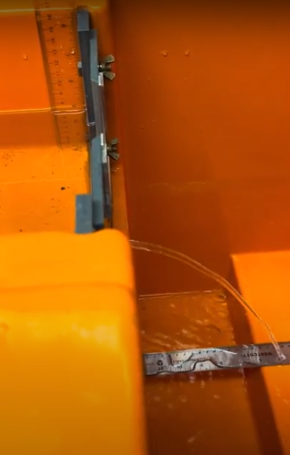

# Lab Demo: Hydrostatic Pressure and Nozzle Velocity

## Theory

In this experiment, we are considering the scenario where water is filled in a rectangular tank up to a height H. There is a small circular hole at the bottom of the tank through which water is exiting. We assume that the water is incompressible. The flow of water out of the tank can be analyzed using principles of fluid dynamics.

### Bernoulli’s Equation Applied to the System

For an incompressible fluid, Bernoulli’s equation along a streamline from the water surface (point 1) to the hole at the bottom (point 2) is:

$$ P_1 + \frac{1}{2}\rho v_1^2 + \rho gh_1 = P_2 + \frac{1}{2}\rho v_2^2 + \rho gh_2 $$

Given:
- $P_1 = P_2 = P_{\text{atm}}$, the atmospheric pressure at both the water surface and the exit of the hole.
- $h_1 = H$, the height of the water column.
- $h_2 = 0$, considering the reference level at the hole.
- $v_1$ and $v_2$ are the velocities of water at the surface and at the hole, respectively.

Simplifying the equation by canceling out $P_{\text{atm}}$ and rearranging terms:

$$ \frac{1}{2}\rho v_1^2 + \rho gH = \frac{1}{2}\rho v_2^2 $$

### Continuity Equation

The continuity equation for an incompressible fluid states that the volume flow rate must be constant throughout the flow:

$$ A_1v_1 = A_2v_2 $$

Where:
- $A_1$ is the cross-sectional area of the tank.
- $A_2$ is the cross-sectional area of the hole.
- $v_1$ and $v_2$ are the velocities of water at the surface and at the hole, respectively.

### Solving the Equations

From the continuity equation, we can express $v_1$ in terms of $v_2$:

$$ v_1 = \frac{A_2}{A_1}v_2 $$

Substituting $v_1$ in Bernoulli’s equation:

$$ \frac{1}{2}\rho \left(\frac{A_2}{A_1}v_2\right)^2 + \rho gH = \frac{1}{2}\rho v_2^2 $$

Solving for $v_2$, we get:

$$ \frac{1}{2}\rho \frac{A_2^2}{A_1^2}v_2^2 + \rho gH = \frac{1}{2}\rho v_2^2 $$

$$ \left(\frac{1}{2}\frac{A_2^2}{A_1^2} + \frac{1}{2}\right)\rho v_2^2 = \rho gH $$

$$ \left(\frac{A_2^2 + A_1^2}{A_1^2}\right)\frac{1}{2}\rho v_2^2 = \rho gH $$

$$ v_2^2 = \frac{2gHA_1^2}{A_2^2 + A_1^2} $$

$$ v_2 = \sqrt{\frac{2gHA_1^2}{A_2^2 + A_1^2}} $$

### Taking the Small Area Limit

Now, if we consider the limit where $A_1 >> A_2$, the term $A_2^2$ becomes negligible compared to $A_1^2$, and the equation simplifies to:

$$ v_2 \approx \sqrt{2gH} $$

This result aligns with the simplified case where $v_1 \approx 0$ (assuming the area of the tank is much larger than the area of the hole). It shows how the velocity of water exiting the hole is primarily determined by the height of the water column, assuming the hole's area is much smaller than the tank's cross-sectional area.

To find the distance the water travels after exiting the small hole at the bottom of the tank, we can use the equation for projectile motion. When the water exits the hole, it behaves like a projectile under the influence of gravity. Given that the tank is above the height $H_{\text{tank}}$ above the ground, the total distance to the ground from the hole is $H_{\text{tank}}$.

### Projectile Motion

When the water exits the hole, it has a horizontal velocity component $v_{2}$ (as derived earlier) and a vertical component that is initially 0 since it exits horizontally. The distance $R$ (range) that the water travels can be found using the formula for the range of a projectile launched from a height:

$$ R = v_{2} \times t $$

Where $t$ is the time it takes for the water to hit the ground. To find $t$, we use the equation for the vertical motion:

$$ H_{\text{tank}} = \frac{1}{2}gt^2 $$

Solving for $t$, we get:

$$ t = \sqrt{\frac{2H_{\text{tank}}}{g}} $$

Substituting the value of $v_{2}$ from the previous derivation:

$$ v_{2} = \sqrt{\frac{2gH}{A_2^2 + A_1^2/A_1^2}} $$

And considering the limit where $A_1 >> A_2$, simplifying $v_{2}$ to:

$$ v_{2} \approx \sqrt{2gH} $$

The range $R$ can now be calculated as:

$$ R = \sqrt{2gH} \times \sqrt{\frac{2H_{\text{tank}}}{g}} $$

$$ R = \sqrt{4H \cdot H_{\text{tank}}} $$
## Procedure:

1. **Filling the Reservoir:**
   - We filled the large orange-colored reservoir with water.
   - The reservoir dimensions were: 
     - Length: $70\,cm$
     - Breadth: $26.5\,cm$
   - Diameter of the smaller opening at the bottom of the tank $\approx 0.6\,cm$

2. **Initiating Water Flow:**
   - We opened the bottommost screw, positioned approximately 1 cm above the tank's bottom, to allow water to flow out.

3. **Recording Measurements:**
   - As the tank emptied, we recorded the following measurements multiple times:
     - Height of the water relative to the hole.
     - Distance from the hole to where the water squirts before striking the ground.
   - We also measured $H_{\text{tank}} = 25 cm$.
## Results

- The experimental setup is illustrated in the figure below, depicting the process where water ejects through a smaller aperture and undergoes projectile motion until impacting a metallic scale positioned beneath to ascertain the projectile's range. Concurrently, another transparent scale is utilized for gauging the water level within the tank.

- The entire sequence of our experiment is documented in a video available at the following link: [Experiment Video](https://drive.google.com/file/d/1liYaju8dAr2Ju6-Raz8xzO9SSOhJ7lc2/view?usp=drive_link).

- The subsequent figure shows the relationship between the distance from the aperture to the point of impact and the water level at various instances.

## Discussion

The experiment conducted to examine hydrostatic pressure and nozzle velocity delved into the fluid dynamics governing the egress of water through a diminutive orifice situated at the tank's base. Predicated on Bernoulli's equation and the continuity equation, the endeavor aimed to elucidate the exit velocity of water and its ensuing projectile motion.

Contrary to theoretical predictions suggesting a correlation of the form $y = A\sqrt{x}$ between water level and projectile distance, empirical findings diverged from this model. Potential sources of discrepancy include:

- The dispersion of water upon impact, forming a circular pattern on the ground, was not meticulously accounted for when measuring projectile ranges, possibly skewing data.

- Height measurements of the water within the tank were conducted using a transparent scale, where refraction effects complicated the accurate determination of water surface height from the tank's bottom.

- A methodological enhancement to reduce measurement error could have been the averaging of multiple projectile range readings at consistent water levels.

- The range of water level heights ($H$) explored was confined to 4-9 cm. A broader spectrum of measurements, particularly at elevated levels, might have yielded a trend more congruent with theoretical projections of $y = A \sqrt{x}$. The experimental design precluded higher water level assessments due to the configuration of an obstruction at the tank's terminus.

## Conclusion

The laboratory demonstration focusing on hydrostatic pressure and nozzle velocity aimed to investigate the dynamics of water flowing through a small aperture at the bottom of a tank, utilizing principles of fluid dynamics and the application of Bernoulli's and continuity equations. 

Experimental findings, however, revealed discrepancies between theoretical predictions and observed data. These discrepancies could be attributed to several factors, including measurement inaccuracies due to water dispersion upon exit, the effects of refraction on height measurements, and the limited range of water levels tested. Despite these challenges, the experiment offered valuable insights into the complexities of fluid dynamics in practical applications.

Recommendations for future experiments include adopting more precise measurement techniques to account for dispersion and refraction effects, and exploring a broader range of water heights to fully capture the relationship between water column height and exit velocity. Additionally, further investigation into the effects of varying aperture sizes on exit velocity and projectile motion could provide deeper understanding of fluid dynamics principles in real-world scenarios.

