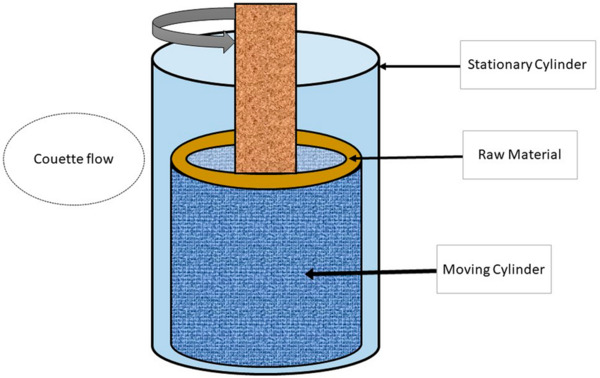
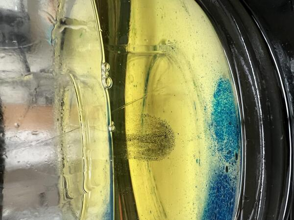
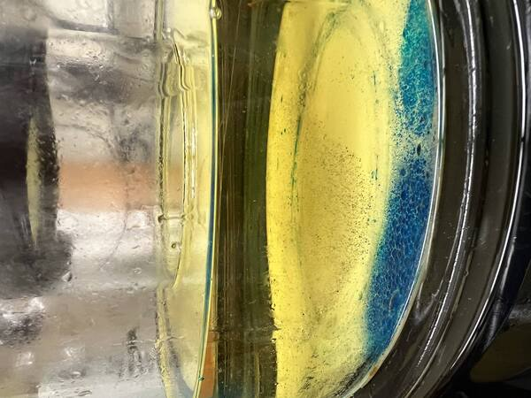
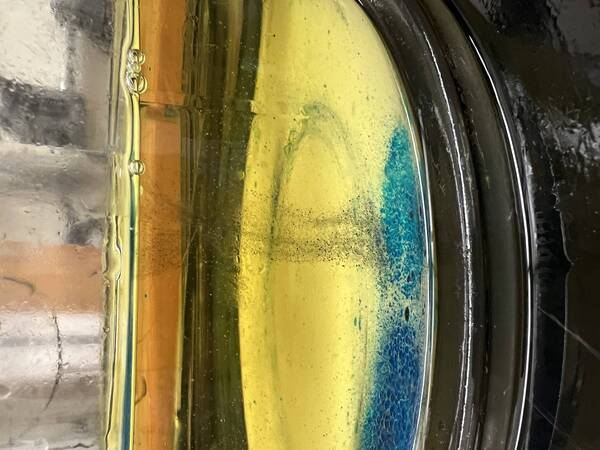
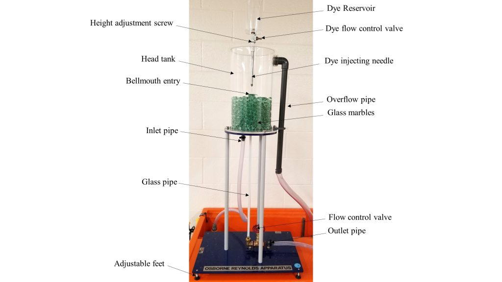
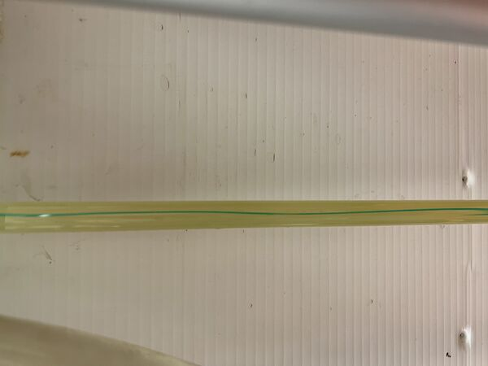
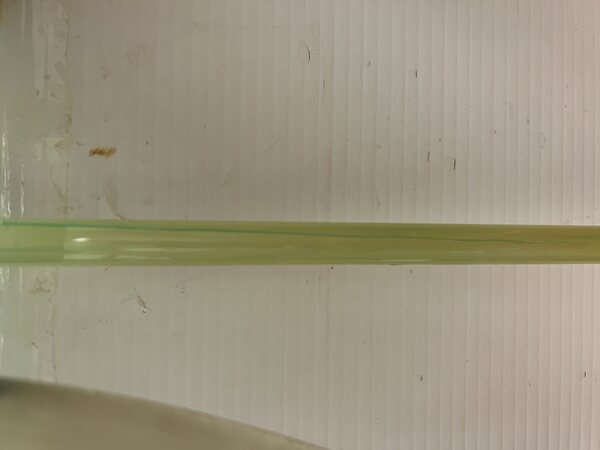
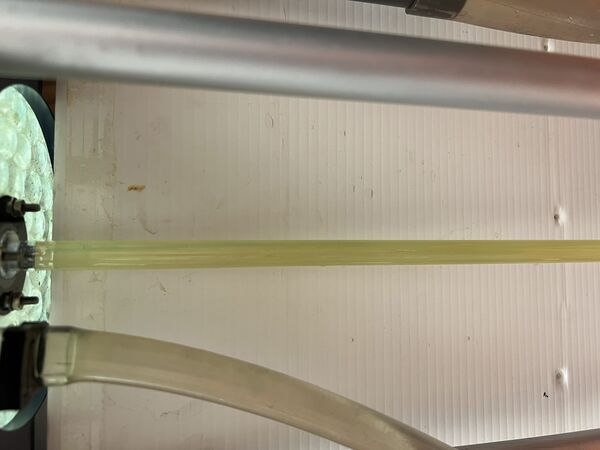

In this lab report, I will present two examples of experiments in which to explore the properties of laminar flow. The first experiment uses a Couette Cell, pictured below, to demonstrate that laminar flow is a reversible process. The second experiment uses an Osborne Reynolds apparatus to numerically determine the Reynolds Numbers that correspond to the region of laminar flow for water.




The Couette Cell (above) consists of a large cylinder with a smaller cylinder inside it. The outer cylinder is stationary while the inner cylinder can spin within the larger cylinder, dragging any fluid between the cylinders with it. In order to show that laminar flow is a reversible process, or that entropy doesn't increase during laminar flow, we must do a process and reverse it. The Couette Cell can accomplish this by mixing dye into the fluid by spinning the inner cylinder in one direction, then unmixing the dye by spinning the inner cylinder in the opposite direction. One of the main challenges to showing this effect is the creation of a steady spot of dyed fluid. I used vegetable oil, and my dye was denser than the oil, so it would often sink to the bottom, where the friction would hinder the circular motion generated by the spinning inner cylinder. Therefore, I premixed the dye with oil before inserting it into the oil, creating the spot pictured below.



After creating this spot, I slowly rotated the inner cylinder clockwise, careful to go at a steady pace. This mixed the dye into the oil until it was almost invisible.



Then, slowly rotating the cylinder counterclockwise for the same number of turns brought the dye back into a resolved spot. Notice that the dye has visibly sunk to the bottom, showing the importance of making a balanced dye spot.



The Osborne Reynolds apparatus can be used to show the flow of dye through a pipe. It has a tank that is filled by water from a reservoir through a pump below the tank, and empties back into that reservoir through a pipe. There is an opening at the top of the tank from which dye can be inserted directly above the pipe to limit mixing before observing the desired flow through the pipe. There are beads in the bottom to disrupt the flow entering the bottom of the tank to make sure the flow through the pipe is undisturbed. The speed of the flow through the pipe can be adjusted by a knob beneath the tank.



I used this knob and two Erlenmeyer flasks of volumes 200mL and 1000mL and with each having a quoted uncertainty of 5% to measure the time it took to fill these flasks at various flow speeds adjusted by the knob. For low flow speeds, I found it helpful to turn off the water being pumped into the tank, but this wasn't possible for higher flow speeds since the tank would quickly empty. With time and volume, I calculated the volumetric flow rate and uncertainty using the following equations:

$$u=\frac{V}{t}$$

$\sigma_{u}=\sqrt{\frac{1}{t}^2*\sigma_{V}^2+\frac{V}{t^2}^2*\sigma_{t}^2}$.

with the uncertainty in the volume given by which flask I used in the measurement and the uncertainty in time taken to be a base .05s. Now, the equation for Reynolds Number is,

$R=\frac{UL}{\nu}$,

with U being the velocity, L being the width of the pipe, and $\nu$ being the kinematic viscosity. The kinematic viscosity was taken from https://www.ksb.com/en-global/centrifugal-pump-lexicon/article/kinematic-viscosity-1117008 to be $1.002*10^{-6}\frac{m^2}{s}$ with negligible uncertainty. I calculated the velocity and associated uncertainty using the cross sectional area of the pipe, who's width I measured to be $1.3cm\pm .05cm$, using the equations

$U=\frac{u}{4\pi L^2}$

$\sigma_U=\sqrt{\frac{1}{\pi L^2}^2*\sigma_u^2+\frac{2u}{\pi r^3}^2*\sigma_L^2}$.

With these values, I could calculate the Reynolds Number for all my data points, which I visually classified as laminar, semi-turbulent, or turbulent, using the uncertainty relation

$\sigma_R=\sqrt{\frac{L}{\nu}^2*\sigma_U^2+\frac{U}{\nu}^2*\sigma_L^2}$

These numbers are shown in the table below as well as images of a laminar, semi-turbulent, and turbulent flow respectively.

| Volume (mL) | Time (.05s) | Flow Rate ($\frac{m^3}{s}$) | Flow Rate Uncertainty ($\frac{m^3}{s}$) | Velocity ($\frac{m}{s}$) | Velocity Uncertainty ($\frac{m}{s}$) | Reynolds Number | Reynolds Number Uncertainty | Classification |
| :-: | :-: | :-: | :-: | :-: | :-: | :-: | :-: | :-: |
| 200 (5) | 10.8 | $1.85 * 10^{-5}$ | $6.55 * 10^{-5}$ | .035 | .12 | 454 | 1556 | Laminar |
| 200 (5) | 15.8 | $1.27 * 10^{-5}$ | $4.75 * 10^{-5}$ | .024 | .089 | 311 | 1155 | Laminar |
| 200 (5) | 6.4 | $3.13 * 10^{-5}$ | $1.1 * 10^{-4}$ | .059 | .21 | 765 | 2725 | Turbulent |
| 1000 (25) | 19.2 | $5.2 * 10^{-5}$ | $8.24 * 10^{-5}$ | .098 | .16 | 1271 | 2076 | Turbulent |
| 1000 (25) | 25.8 | $3.88 * 10^{-5}$ | $6.13 * 10^{-5}$ | .073 | .12 | 947 | 1557 | Semi-turbulent |
| 1000 (25) | 83.1 | $1.2 * 10^{-5}$ | $1.9 * 10^{-5}$ | .023 | .036 | 298 | 467 | Laminar |
| 1000 (25) | 31.1 | $3.22 * 10^{-5}$ | $5.09 * 10^{-5}$ | .061 | .096 | 791 | 1246 | Semi-turbulent |
| 1000 (25) | 8.2 | $1.22 * 10^{-4}$ | $1.93 * 10^{-4}$ | .23 | .36 | 2984 | 4672 | Turbulent |





In the Laminar cases, the dye maintained its shape throughout the pipe. In the semi-turbulent cases, the dye would fluctuate between maintaining its shape and mixing with the water surrounding it. Also, it would become more evenly mixed further down the pipe. In turbulent cases, the dye was mixed with the water upon entering the pipe. While the uncertainties of my numbers are very high, the visual confirmation seems to support that turbulence became a factor at a Reynolds Number of around 700 and that the flows become fully turbulent at a Reynolds Number of 1000. The large uncertainties mostly come from the timing of the initial measurements. Using larger flasks for longer times would substantially reduce the uncertainty, as shown in the reduction of relative uncertainty between the 200mL and 1000mL flasks. There is an outlier in my data for the Reynolds Number of 765 being labeled as turbulent instead of semi-turbulent. However, this measurement was taken on the less precise 200mL flask.


```python

```


```python

```


```python

```


```python

```
