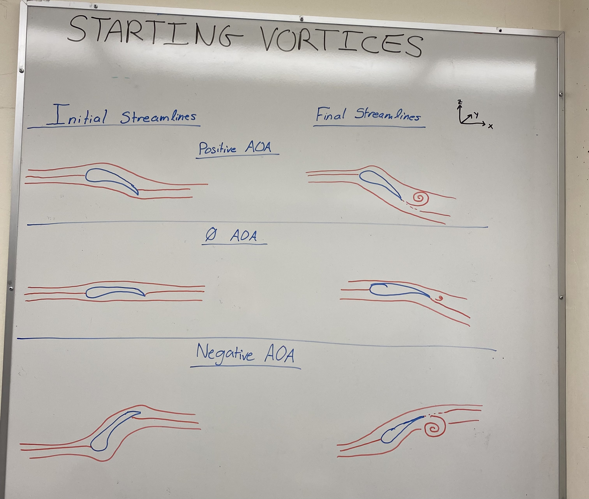
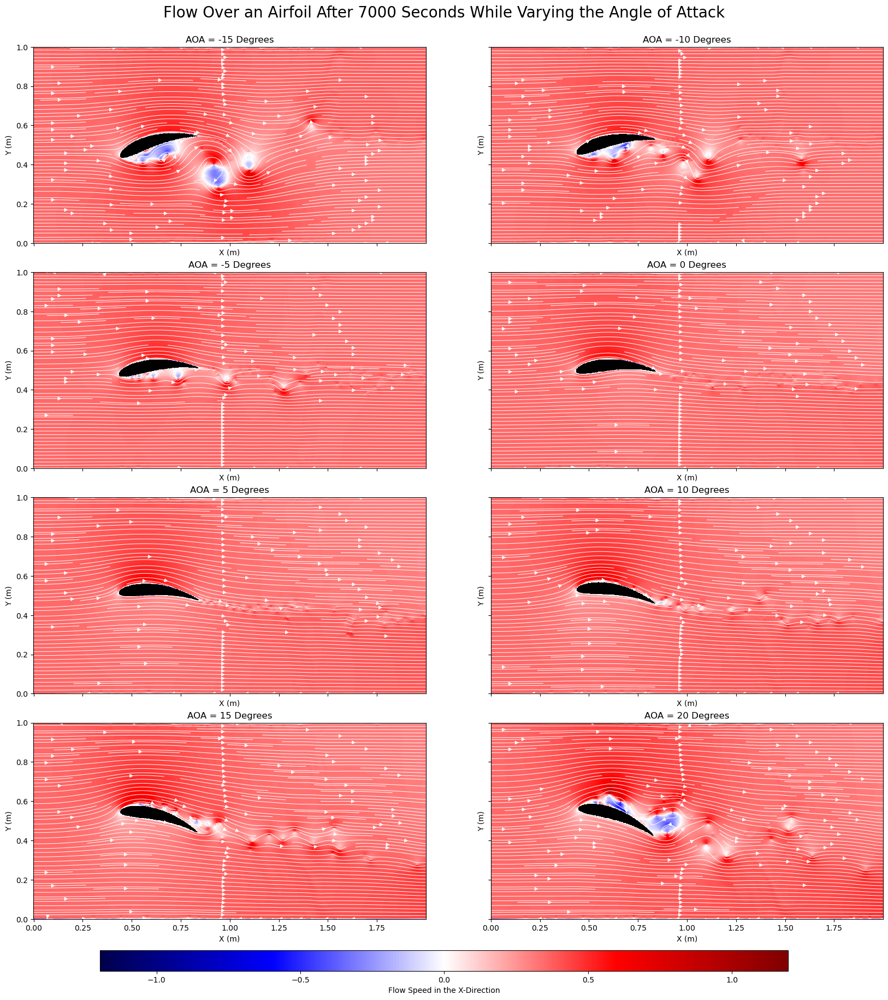
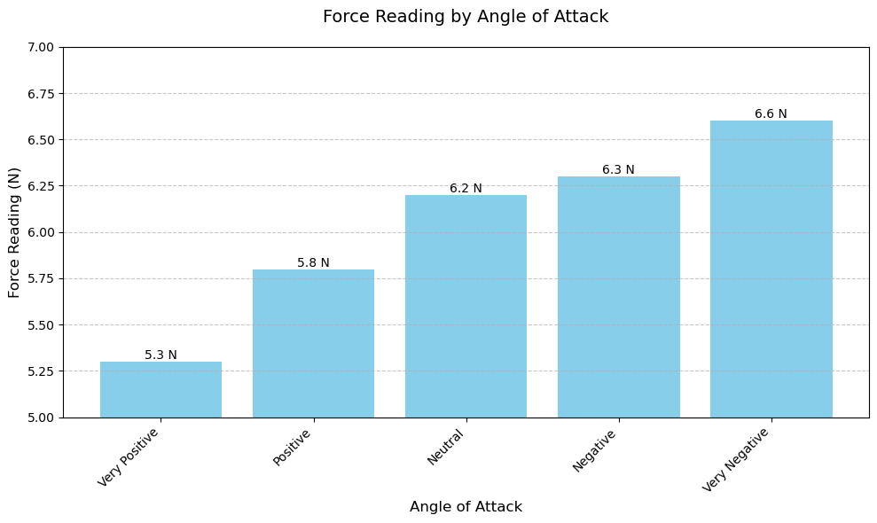

### Introduction:

When fluid flows against a solid body it creates a force on that body. The component of force perpendicular to the body is defined as lift whereas drag is defined as the force that acts perpendicular to the flow. In our case we are investigating flow over and airfoil and lift typically acts in the upwards direction opposite to that of gravity. Simply put, lift is the difference in pressure forces around the airfoil. For lift to occur the pressure force underneath the wing must be higher than that above the wing. By bernoulli's function,
$$
\frac{P}{\rho} = \frac{P_{\infty}}{\rho} + \frac{u_{\theta}^2}{2} + \frac{U^2}{2}
$$

this mean that the fluid flows faster over the top of the airfoil compared to the bottom in order for lift to occur.

When an airfoil is accelerated from rest, a starting vortex will form. This starting vortex will vary in strength and direction depending on the angle of attack which is defined as the tilt of the airfoil from neutral. To understand what the direction and magnitude of the starting vortex will be when accelerated from rest, we need to understand where the dividing streamlines are before acceleration. The dividing streamline will be intially above or below the trailing edge of the airfoil depending on the angle of attack. This creates a sharp turn that the fluid cannot make and when accelerated we will encounter flow seperation and the forming of the starting vortex. Below are diagrams of the predicted initial streamlines and the direction of the starting vortex after acceleration.

*Figure 1: Predicted initial streamlines and the direction of the starting vortex after acceleration.*

Furthermore, by circulation theorem we can say that circulation around a closed loop gives the vorticity area integral inside a closed contour.

$$
\Gamma = \oint_C \vec{u} \cdot d\vec{l} = \int_S \vec{w} \cdot d\vec{s}
$$

Around a loop that contains the starting vortex and the airfoil, we can say that the net circulation is $0$. This means that around the airfoil circulation is being spun up in opposite direction and magnitude to the starting vortex. By the Kutta-Zhukovsky theorem, for any body in a 2-D ideal flow with no friction, lift can be expressed as:

$$
L = U \Gamma \rho
$$

In fact anytime an airfoil is accelerated it will create and shed another vortex that will alter the circulation around the wing.

For the Kutta-Zhukovsky theorem to hold true, the object question must have a sharp trailing edge and the flow must have two stagnation points, meaning the flow at those points is zero. The Kutta-Condition states that the circulation around the body must be of great enough strength to hold the rear stagnation point at the sharp trailing edge. When this is condition is satisfied, the flow is smooth and effective at generating lift. If the flow seperates from the wing and the rear stagnation point no longer sits at the trailing edge we will see an eddie form behind the wing and the Kutta-Condition will no longer be satisfied. When this occurs lift is not generated effectively.

The reason this back eddie forms and the Kutta-condition is no longer satisfied is from large pressure changes in the boundary layer causing reversals in the flow. This typically occurs for an airfoil at large positive or negative angles of attack. Below is fluid simulation run until quasi-steady state was reached and this demonstrates when the Kutta-Condition is satisfied or not.

*Figure 2: Streamlines flowing over an airfoil at varying angles of attack.*

### Procedure:

__Starting Vortex Demonstration:__

A tub was filled approximately an inch thick with water. An airfoil was then placed in the water and a few drops of dye we're placed in the water on the trailing edge of the airfoil. The airfoil was then pulled through the water at a neutral angle and the starting vortex was spun up and well demonstrated in the dye. The procedure was then repeated for high and low angles of attack.

__Wind Tunnel Streamlines:__

An airfoil was placed in a windtunnel at a neutral angle of attack. A smoke machine was set up in front of the airfoil and a laser was set up behind the airfoil. The lights were then turned off and the windtunnel and smoke machine were turned on. This was an easy way to show the streamlines flowing over the airfoil. The angles of attack were adjusted and the streamlines for those cases were recorded. An uncalibrated force measurement was taken for each angle of attack to give a qualitative understanding of how lift varies with the angle of attack.

### Results:

__Starting Vortex Demonstration:__

<video controls src="https://ocean-physics.seos.uvic.ca/~jklymak/Movies/IMG_5946.mov" title="Investigating the Effects of Angle of Attack on the Starting Vortex"></video>
*Video 1: Starting vortex demonstration for different angles of attack.*

__Wind Tunnel Streamlines:__

Large Positive AOA:
<video controls src="IMG_5959.mov" title="Large Neg"></video>
*Video 2: Streamlines for a large positive angle of attack.*

Positive AOA:
<video controls src="IMG_5960.mov" title="Neg"></video>
*Video 3: Streamlines for a positive angle of attack.*

Neutral AOA:
<video controls src="IMG_5961.mov" title="Neutral"></video>
*Video 4: Streamlines for a neutral angle of attack.*

Negative AOA:
<video controls src="IMG_5962.mov" title="Pos"></video>
*Video 5: Streamlines for a negative angle of attack.*

Large Negative AOA:
<video controls src="IMG_5963.mov" title="Large Pos"></video>
*Video 6: Streamlines for a large negative angle of attack.*

__Force Measurements:__

| Angle of Attack      | Force Reading (N) |
|-----------------------|-------------------|
| Very Positive         | 5.3              |
| Positive              | 5.8              |
| Neutral               | 6.2              |
| Negative              | 6.3              |
| Very Negative         | 6.6              |

*Table 1: Force readings for various angles of attack.*

*Figure 3: Graphical representation of force readings for various angles of attack.*

### Discussion:

__Starting Vortex:__

As can be seen in the starting vortex demonstration video, (video 1), the experimental results match the predictions made in Figure 1. A neutral angle of attack generates a small counter-clockwise vortex, a positive angle of attack generates a large counterclockwise vortex and a negative angle of attack generates a large clockwise vortex. The vortex generated by the neutral angle of attack is due to the shape of the airfoil itself, which is designed to optimize lift generation, even at little to no positive angle of attack.

The formation of these starting vortexes has significant importance. As the airfoil accelerates, the fluid at the trailing edge cannot turn sharply enough to adjust to the new motion so a vortex is shed. According to the Kutta condition, the airflow must leave the trailing edge of the airfoil smoothly. To satisfy this, the airfoil develops circulation (a bound irrotational vortex) around it, essential for lift. The starting vortex balances this by having equal and opposite circulation, thanks to conservation of angular momentum.

Thanks to the qualitative nature of this experiment sources of error are not much of a concern, however some improvements could still be made. Accelerating the airfoil through the fluid produced a clear vortex that quickly became disturbed by the water sloshing back from the walls of the tub. A larger tub in combination with a more gentle pull of the airfoil could remedy this issue. In addition, pulling the airfoil by hand produced inconsistent results and left lots of room for human error. Building a track above the tub with a way to fix the airfoil at a desired angle of attack would allow the student to produce consistent results.

__Wind Tunnel Streamlines:__

For the neutral angle of attack we can clearly see the attached streamlines and we do not notice any flow separation. As we increase the angle of attack positively, we can see the flow starts to detach itself at the back of the wing and moving to the large positive AOA, the streamlines are fully detached from the wing. We can see this by the fact that no smoke is coming off the leading edge like it did in the neutral AOA case. As we decrease the angle of attack we can see that the flow once again separated as the AOA is decreased.

Through most of the trials, the viewer can observe the Kutta Condition being satisfied, the streamlines are attached and leave the trailing edge smoothly.

In aerodynamics, flow separation on the upper surface of the airfoil is referred to as a stall. A stall can be seen in the wind tunnel when using a large positive angle of attack (figure ?). In this case, the Kutta Condition is no longer satisfied since the flow is not attached to the airfoil, after separation, the flow becomes turbulent and highly unstable.

Throughout every trial, the airfoil was connected to a force measurement device attached to the airfoil and was recording data. The results can be seen in table 1. It is important to note that the measurement device used was uncalibrated and gave inaccurate force readings. Despite this, we can still examine the trends to see that at positive angles of attack, the force was more than at negative angles of attack. These results make sense since at negative angles of attack, negative lift is generated which pushes harder on the sensor, and at positive angles of attack lift was generated and relieved the sensor of the airfoils weight. Furthermore, we would expect a decrease/increase in force for when the stall angle is hit and back eddies are created behind the wing. This does not happen even though in the videos they are clearly observed. The wind tunnel was at the same wind strength setting for all trials.

This experiment did well in demonstrating the properties of an airfoil moving through a fluid, however there is room for improvement. A properly calibrated force measurement device would allow for more reliable quantitative measurements to be taken. The smoke machine used in this experiment was broken and sprayed hot liquid glycerine in between spurts of smoke. These glycerin sprays not only burnt the experimenters but also caused glycerin to accumulate on the airfoil and the glass, which may have altered lift generation and made it difficult to see into the wind tunnel.

### Conclusion:

In conclusion, the experiments performed allowed the experimenters to gain physical intuition concerning lift. The qualitative observations provided experimenters to see important fluid mechanics theory in action, like conservation of circulation and the Kutta-Zhukouski Theorem.